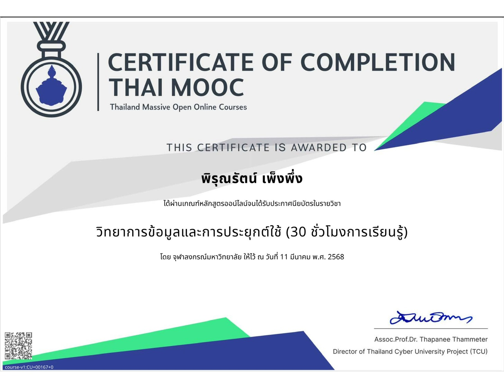
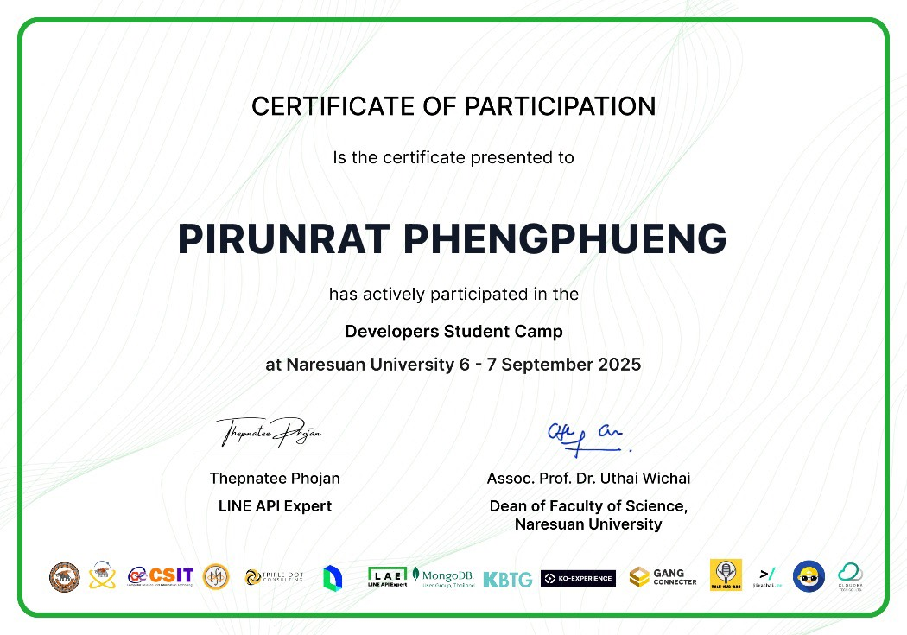
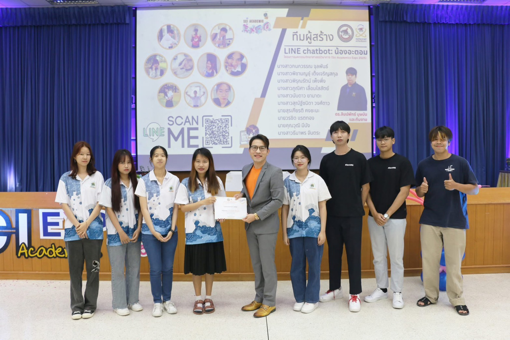

# Hi, I'm Pirunrat 👋

🎓 Data Science Student | Naresuan University
---

## Skills

- Python
- R
- SQL
- Excel
- Power BI
- Machine Learning
- Data Analysis
- Data Visualization
- Dashboard Design

## Certificates & Activities

| Certificate / Activity | Description | Image |
|---|---|---|
| Data Science and Applications — Thai MOOC | Completed online training in data science, data processing, and applied analytics. |  |
| Developers Student Camp — Naresuan University | Participated in a developer camp focused on programming, technology, and collaborative learning. |  |
| LINE Chatbot Project Activity — Sci Academy Expo 2025 | Supported a student chatbot project presentation and team-based technology activity. |  |

- Additional academic and technology-related activities

## Contact

📧 Email: pirunratp66@nu.ac.th
